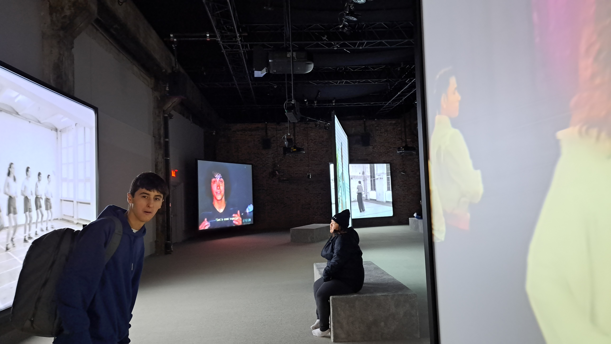
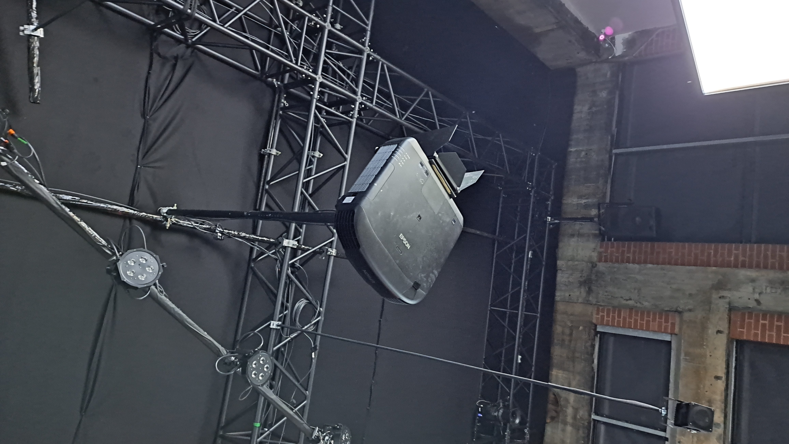
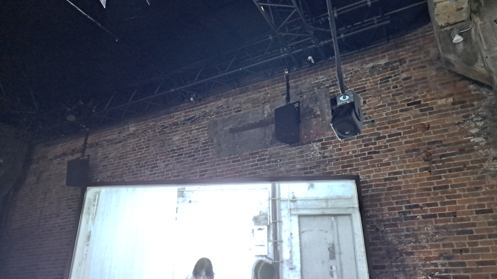
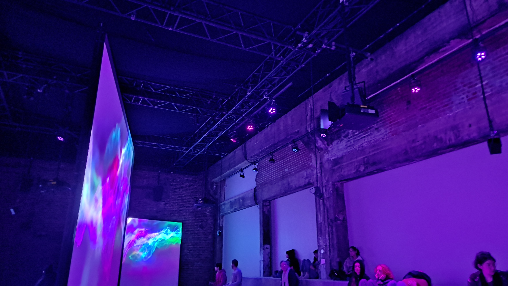
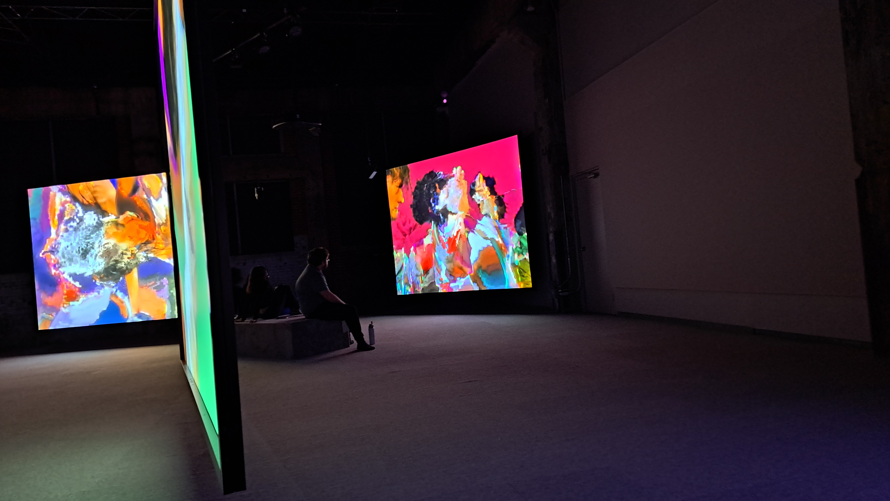

# Phase Shifting Index #
## Jeremy Shaw ##

Voici la fiche d'inspiration pour l'exposition "Phase shifting index" de Jeremy Shaw visité le 2 février 2024 à la Fonderie Darling à Montréal.

### Description de l'oeuvre ###

Phase shifting index est une exposition immersive multimédia qui utilise sept projections de "films documentaires" sur la dance et plusieurs haut-parleurs ciblés vers des zones spécifiques pour nous faire vivre une expérience psychédélique.

### Description des dispositifs multimédias ###

Cette exposition utilise trois principaux dispositifs multimédias: les projecteurs, les haut-parleurs et les lumières. 

La salle comprend sept projecteurs qui projettent chacun un film différent qui doivent tous être joués en sinchronisation. Sept grandes toiles sont disposés symétriquement à travers la salle d'exposition pour donner une surface libre aux projections.

Deux types de haut-parleurs sont répatis dans la salle d'exposition: les petits haut-parleurs pour cibler une zone et les grands haut-parleurs pour envoyer le son dans toute la salle. Les petits haut-parleurs sont positionnés devant les écrans et pointent vers les places assises devant celles-ci. Ils sont utilisés pour faire en sorte que le son d'un film soit seulement audible l'orsque nous sommes devant l'écran qui projette le film correspondant. Les plus grands haut-parleurs sont placés sur le contour de l"exposition pour que le volume soit égal partout dans la salle. Ils sont seulements utilisés dans la deuxième moitiée de l'expérience pour lier ensemble les sept films lorsqu'ils se sinchronisent.

Les lumières sont aussi seulement utilisés dans la deuxième moitiée de l'expérience pour contribuer à l'immersion des visiteurs puisqu'elles sont pointées vers les endroits où les visiteurs sont positionnés dans cette partie del'exposition.

### Mon expérience ###

Mon expérience personnelle avec Phase shifting index était surement très semblable à celle des autres visiteurs: je me suis déplacé entre les différentes projections en écoutant les documentaires jusqu'à ce que la deuxième partie de l'expérience commence. À partir de ce moment, j'étais confus jusqu'à la fin de la représentation. J'ai apprécié cette exposition, mais je trouve que les oeuvres d'art moderne défient le concept d'un oeuvre d'art, et pas vraiment pour le mieux. L'exposition semblait n'avoir aucun sens ni aucun message à transmettre et elle ressemble plus à un projet que l'artiste à réalisé pour s'amuser.

