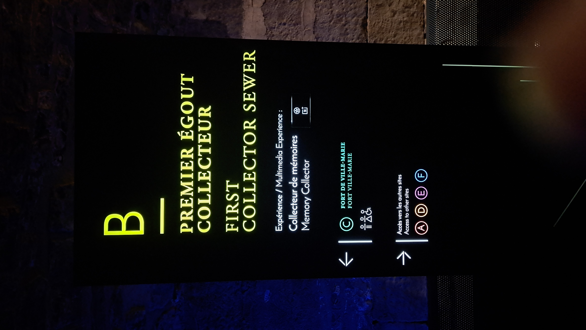
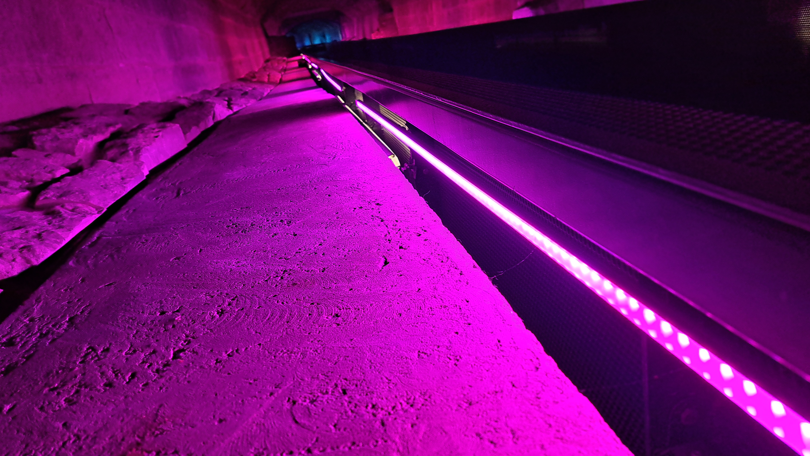
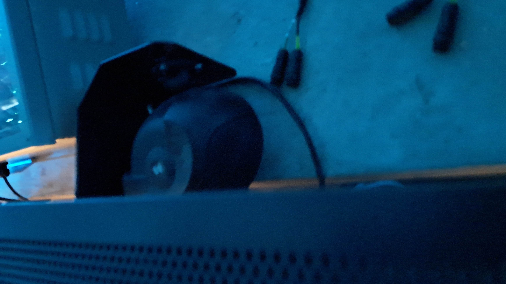
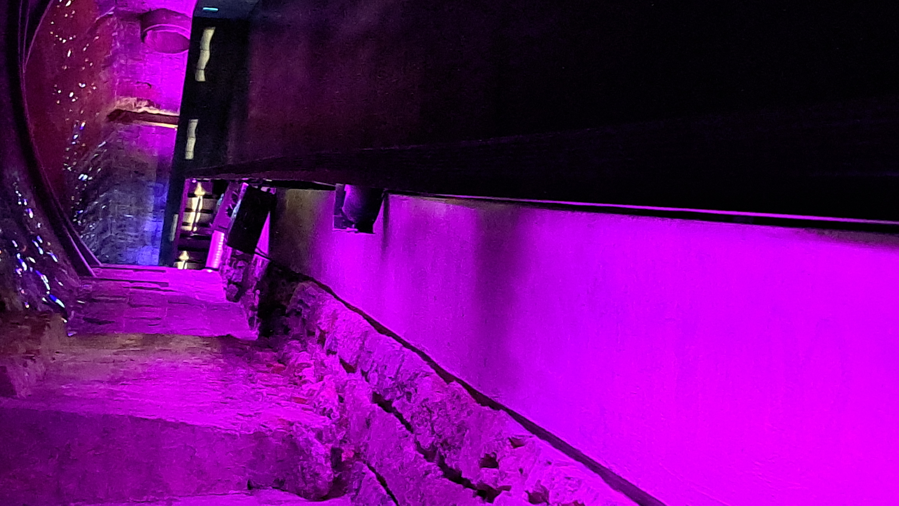
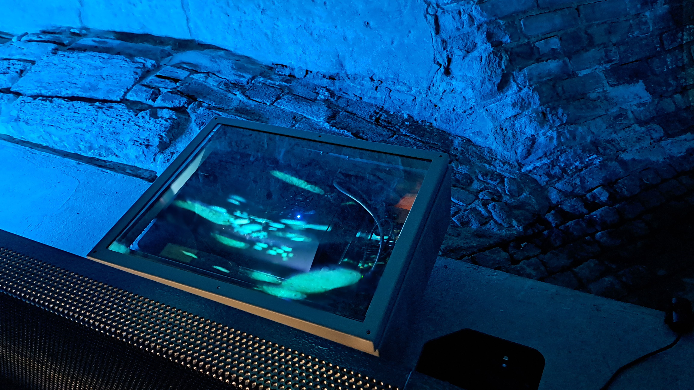
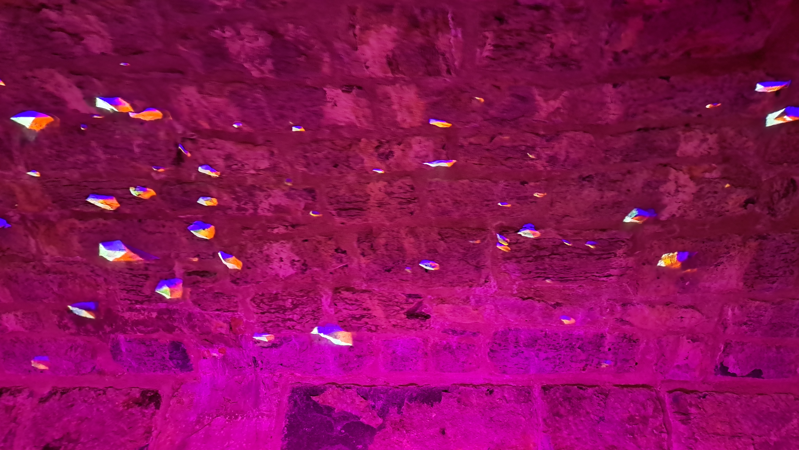
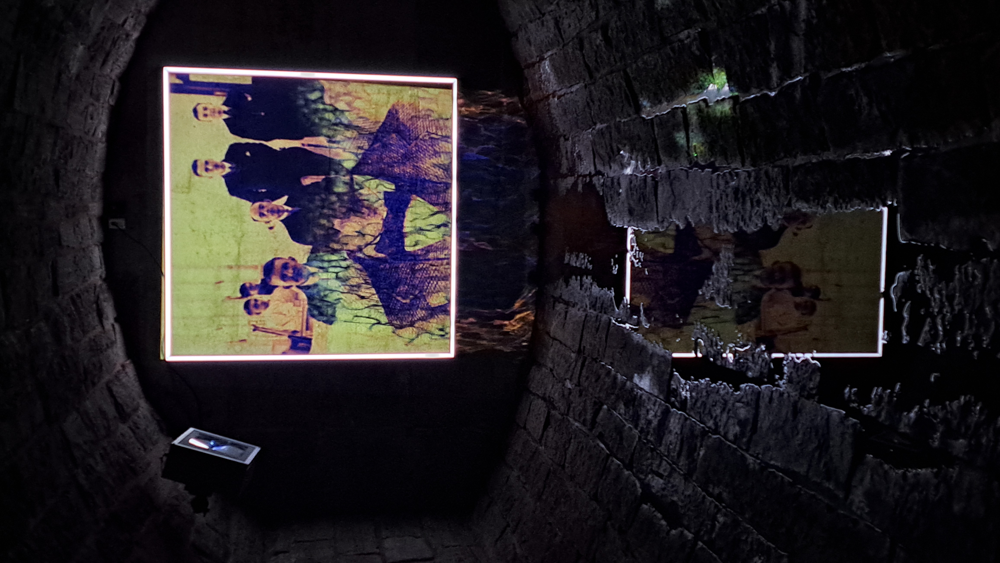

# Présentation visite individuelle #
## Félix Lévesque ##

# Collecteur de mémoires #

Présentation de l'oeuvre et de mon expérience.

## informations ##

  - Collecteur de mémoires.
  - Exposition permanente au musée pointe-à-caillère.
  - Située dans le premier égout de l'amérique du nord
  - Ouverture le 17 mai 2017.
  - Exposition immersive.
  - Visité le 1er mars 2024.

## Dispositifs ##

  - Lumières
  - Projecteurs
  - Haut-parleurs
  - Tous situés le long de la passerelle
  - Aucune interraction

 

## Expérience personnelle ##

  - Apréciation
  - Critique

