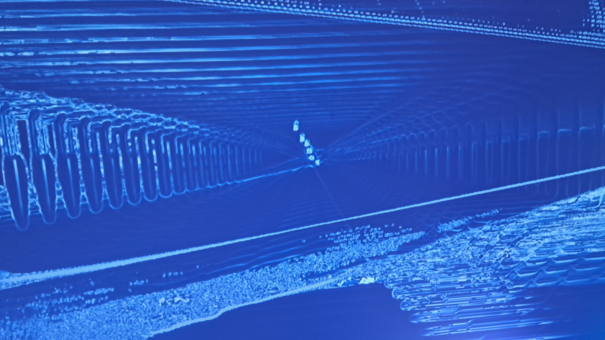

# Crescentia # 
### Collège Montmorency ###

Voici la fiche d'inspiration pour les différentes installation de l'exposition "Crescentia" au collège Montmorency. "Crescentia" est le thème de l'exposition créée par les finissants en tchnique d'intégration multimédia, ce mot signifie croissance en latin et toutes les expositions sonts liées à ce thème d'une façon ou d'une autre.

## Canevas Cosmique ##

#### Description de l'oeuvre ####

L'installation de "Canevas Cosmique" permet au visiteur d'interragir avec un système solaire en utilisant des objets représentants divers évènements cosmiques et corps célestes. Le lien au thème de "Crescentia" de cette exposition est la croissance et le changement constant de l'univers et du monde.

#### Description des dispositifs multimédia ####

L'oeuvre est composée d'un projecteur et d'une kinect sous une table semi-transparente. En-dessous de chaque statue ce trouve un code que la kinect peut lire, l'information est envoyée au programme qui place le bon objet au bon endroit dans la simulation du système solaire. La simulation est ensuite projetée sous la table et sur le mur en face.

 

### Mon expérience ###

"Canevas cosmique" est l'une de mes installations préférées. C'est très amusant d'expérimenter avec les différentes combinaisons d'objets possibles et de voir les effets des objets sur les planètes et le soleil au centre.

## Rhizomatique ##

#### Description de l'oeuvre ####

Lorsqu'on interragit avec l'installation "Rhizomatique", nous pouvons voir différentes mémoires apparaitre sur les murs devant nous, mais si nous levons la main de la toile, les images disparaissent aussi vite qu'elles sont apparues. Cette installation représente les changements dans nos vies, les souvenirs d'enfance, la nostalgie et nous fait apprécier notre croissance au cours de notre vie ce qui est en lien direct avec le thème de l'exposition.

#### Description des dispositifs multimédia ####

L'interraction se fait par une toile tendue au dessus d'une kinect et d'un projecteur. La kinect détecte les changements de la profondeur de la toile lorsqu'une main est possée dessus. Ensuite, le programme détermine dans quel triers de la toile la main se trouve et les projecteurs au plafond projettent la mémoire sur le mur correspondant. Le projecteur sous la table projette aussi un motif animé qui réagit aux interractions.

 

### Mon expérience ###

J'ai bien aimé "Rhizomatique", je pense que c'est l'installation qui représente le thème de l'exposition le mieux. Cependant, c'était l'installation qui avait le moins d'éléments interractifs de toute l'exposition, ce qui ne retenait pas longtemps les visiteurs.

## Kigo ##

#### Description de l'oeuvre ####

"Kigo" est une installation qui ressemble beaucoup à un jeu. Le visiteur se place devant une projection d'un jeu où le personnage réplique ses mouvements et doit éviter des obstacles. Le lien avec le thème de "Crescentia" est la croissance de l'intensitée et de la vitesse du jeu en plus de la croissance de ton score.

#### Description des dispositifs multimédia ####

Le jeu détecte les actions du joueur par la kinect possée devant l'aire de jeux. Les informations des mouvements du visiteur sont envoyés au jeu qui donne ces mouvements au modèle du joueur. Le jeu envoit différents objets vers le joueur qui, lorqu'ils entrent en contact avec le personnage, peuvent augmenter son score ou lui enlever une "vie". La vitesse du jeu augment petit à petit jusqu'a ce que le joueur perde toute ces trois "vies", le score obtenu est alors comparé au plus haut score atteint par un autre joueur.

### Mon expérience ###

Bien que le jeux soit ammusant, je pense que c'est l'installation qui est la plus détachée du thème de l'exposition, et donc elle ressort parmis les autres expériences, mais pas pour les bonnes raisons.

## Sonalux ##

#### Description de l'oeuvre ####

"Sonalux" est une installation où il n'y a que quelque paires d'écouteurs et un panneau avec plusieurs boutons et roulettes. Lorsque l'on met les écouteurs sur nos oreilles, nous pouvons entendre de la musique qui est controlée par les boutons du panneau. Des effets visuels colorés sont projetés sur les murs et changent avec la musique pour créer une expérience immersive. L'expérience de "Sonalux" nous laisse faire partie de l'installation pour s'immerser complètement dans l'expérience.

 

#### Description des dispositifs multimédia ####

Le panneau d'interraction consiste de quarte boutons controlants quatre sons différents et cinq roulettes controlant les effets qui peuvent être appliquées à la musique. Les boutons activés et le niveau des roulettes définissent la musique qui joue et les visuels montrés sur les murs, ces deux composantes de l'expérience sont le produit de l'algorythme à créé à partir de l'information donnée par les boutons.

 

### Mon expérience ###

"Sonalux" était mon expérience préférée et elle est définitivement la plus immersive. C'est très facile de passer plusieurs minutes à expérimenter avec les différents réglages de la musique et à regarder les visuels hypnotisants. Cette expérince est aussi les représentation la plus abstraite du thème de "Crescentia" sans trop s'en éloigner.

## Effet papillon ##

#### Description de l'oeuvre ####

Lors de la visite de "Effet papillon", les visiteurs doivent interragir avec différents objets à travers la salle pour faire pousser un arbre et ceuillir une "pomme". Les interractions avec l'arbre représentent les stages de croissance d'un arbre, créant le lien avec le thème de "Crescentia". Les objets interactifs représentent des ressources que l'arbre à besoin pour pousser comme des boutons pour "activer" le soleil, une pompe pour donner de l'eau et une corde pour ceuillir la pomme.

 

#### Description des dispositifs multimédia ####

Cette installation contient une grande variétée de dispositifs multimédias. Premièrement, plusieurs projecteurs et haut-parleurs sont installés dans la salle pour créer l'ambience de l'expérience. Ensuite, un poteau couvert de fils et de petits écrans représente l'arbre. Nous pouvons voir l'arbre pousser par les écrans présentants un arbre rendu en 3D. Finalement, les interactions des visiteurs sont détectés via plusieurs objets différents tels que des interrupteurs, des boutons et des cordes.

 

### Mon expérience ###

"Effet papillon" était l'expérience qui ressemblait le plus à une oeuvre d'art qu'à une installation interactive. Je pense que c'est l'une des équipes qui ont réfléchit le plus longtemps à leurs concept et ce concept à très bien été exécuté. C'est définitivement l'une des meilleures oeuvres de l'exposition.
