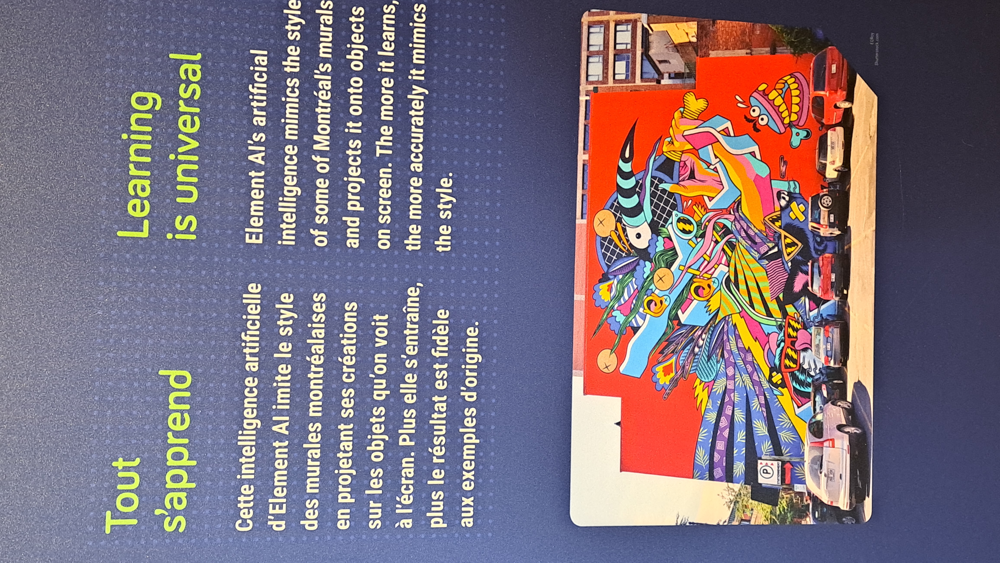
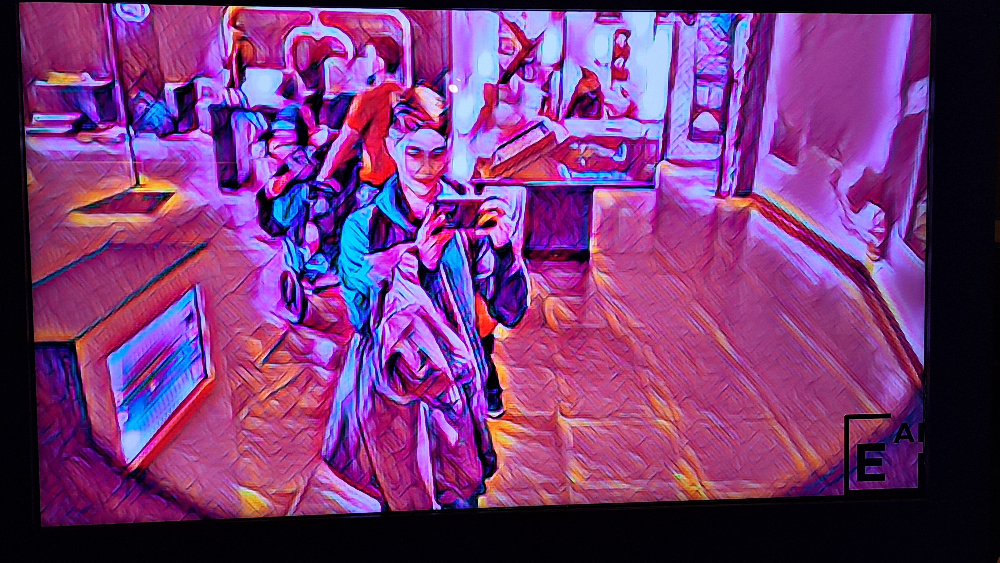
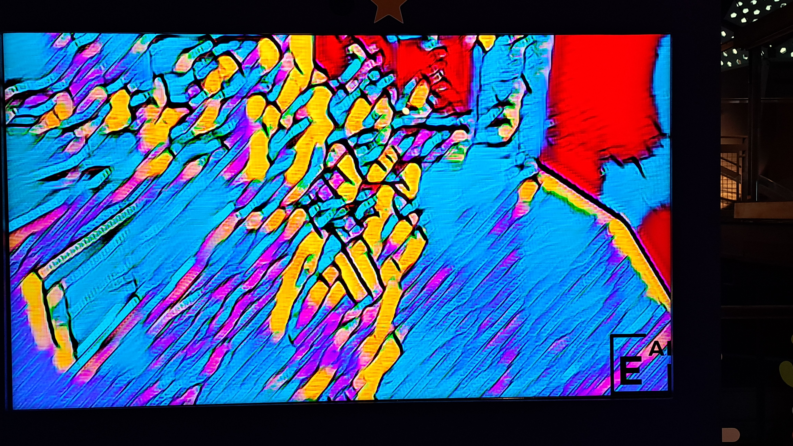
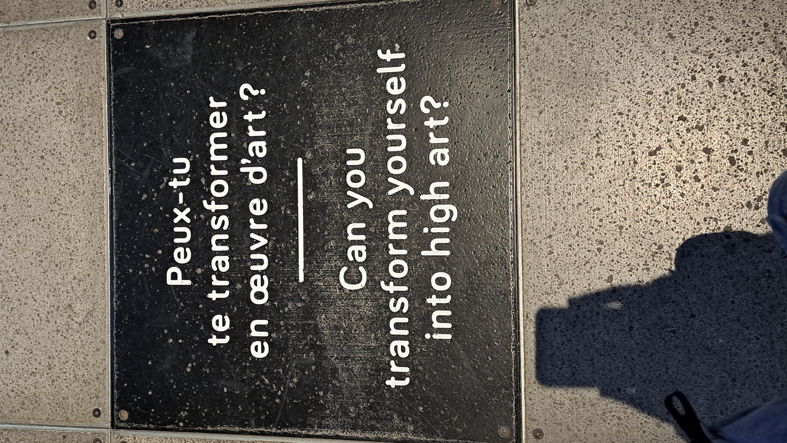
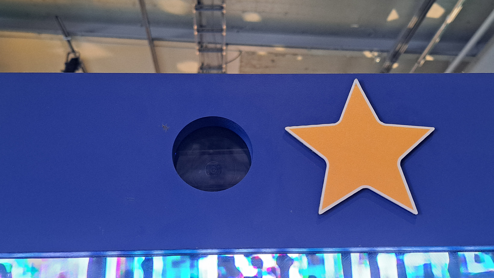
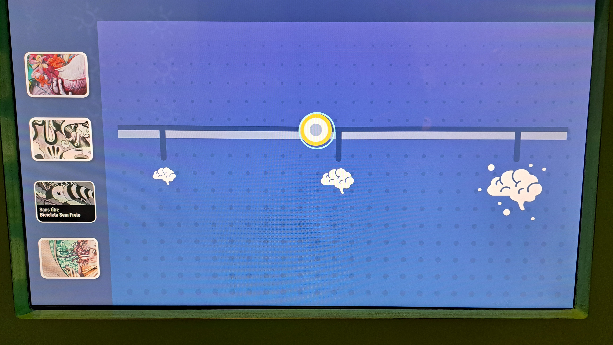
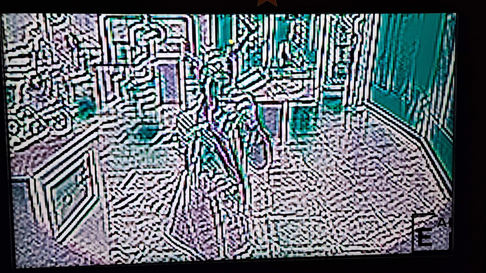
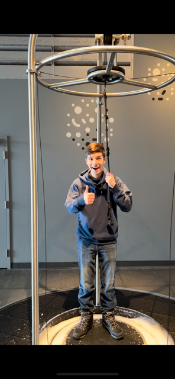
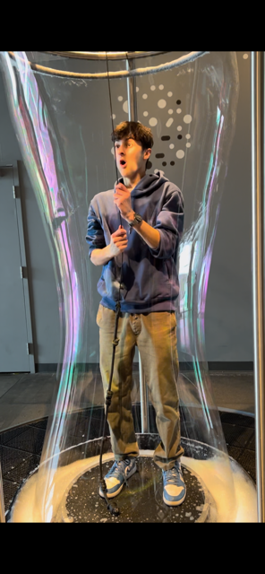

# Dispositif multimédia du Centre des Sciences #

## Intelligence artificielle de création d'images ##

### Introduction ###

Le 5 avril 2024, nous avons visités le Centre des Sciences au vieux port de Montréal. Voici la fiche d'inspiration pour l'installation interactive multimédia que j'ai choisi.

### Description de l'installation ###

L'installation que j'ai choisi est une intelligence artificielle s'entrainant à modifier ce que la caméra voit pour que le résultat ressemble le plus possible aux murales que l'on peut trouver un peu partout dans les rues de Montréal. L'installation nous permet de changer le style d'art à répliquer et le niveau d'intalligence du AI et de voir le résultat sur une vue en direct de ce qui ce trouve devant l'écran. Je trouve ce dispositif intéressant parce qu'il utilise une intelligence artificielle de création d'images, ce qui est une technologie qui n'à été dévellopée que très récemment en parallèle avec d'autres intelligences à aprentissage comme les AI de discussion ou de création de musique.

 

 

### Description des dispositifs multimédia ###

Cette installation de l'exposition permanente du Centre des sciences est consituées de trois dispositifs multimédias principaux. Premièrement, une caméra filme les visteurs qui sonts face à l'installation et envoie cette information vers l'ordinateur qui contient l'AI. Deuxièmement, un écran tactile placée dans le champ de vision de la caméra nous donne quatre options de style artistique à recréer et un slider déterminant la puissance de l'intelligence artificielle, plus ce niveaux est bas, moins l'image finale sera fidèle au style choisi. Finalement, l'intelligence artificielle applique les choix de l'utilisateur aux images fournies par la caméra et le résultat final est affiché sur un écran situé sous la caméra.

  

### Expérience personnelle et conclusion ###

Bien que l'intelligence artificielle utilisée dans cette installation ne soit pas aussi puissante que d'autres AI de création d'images tel que Dall-E ou Midjourney, elle produisait de bons résultat et c'était très amusant d'expérimenter avec les différentes combinaisons de réglages offerts par l'AI. Ce dispositif multimédia m'a intéressé, car je ne m'attendais pas à voir une technologie aussi récente présentée dans l'exposition permanente du Centre des Sciences de Montréal. Pour finir, j'ai bien aimé la visite aux Centre des Sciences, c'était trés intéressant de voir le fonctionnement des dispositifs et l'exposition était elle aussi très intéressente.

 
