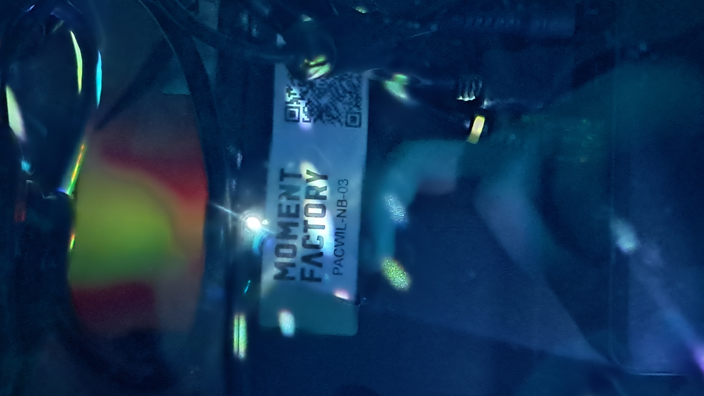
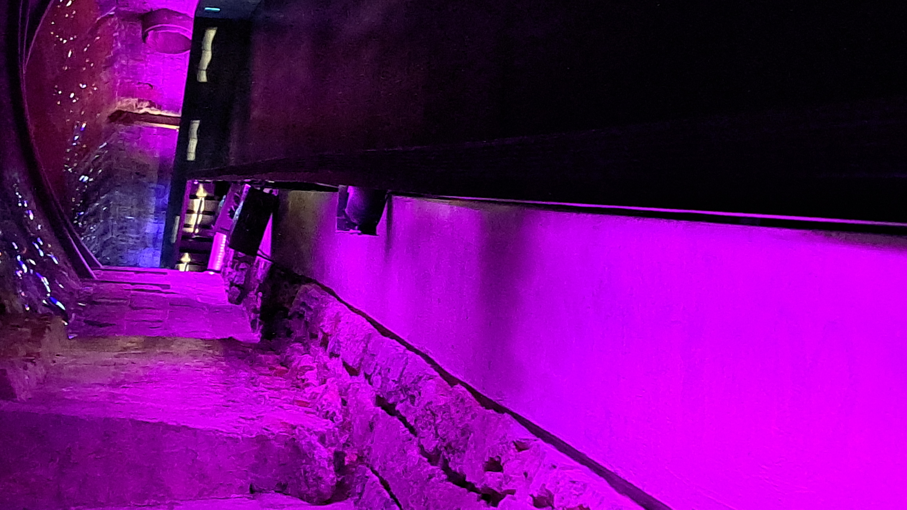

# Collecteur de mémoires #
## Musée pointe-à-caillère ##

Voici la fiche d'inspiration pour l'exposition "Collecteur de mémoires" visité le 1er mars au musée Pointe-à-caillère.

### Description de l'oeuvre ###

"Collecteur de mémoires" est une oeuvre multimédia située dans un ancien égout de la ville de Montréal au musée pointe à caillère. L'exposition consiste d'un long corridor éclairé par des lumières de différentes couleurs, de projecteurs projetant des motifs sur les murs et le plafond et de plusieurs haut-parleurs créeant une ambiance calme. À la fin de l'exposition, le tunnel est bouché par un mur de béton où sont projetées des images anciens citoyens de montréal.

 

### Description des dispositifs multimédias ###

Cette expérience comprend plusieurs dispositifs multimédias cachés le long de la passerelle derrière les balustrades. Premièrement, les longues bandes de lumières font toute la longueure du tunnel et se trouve très proche du haut de la balustrade. Ces lumières chengent constament de couleur tout au long de la visite entre le mauve, le bleu, le rose et le vert.

Ensuite, les motifs et les photos projetés sur les murs proviennent de projecteurs contenus dans des boites protéjées et ventilées pour assurer qu'il ne brisent pas. La vitre sur les boites permet à la lumière de passer mais elle nous permet aussi de voir le logo de Moment Factory entre les composantes électroniques. La plupart des projecteurs se trouvent le long des murs sauf pour un à le fin qui est situé sous le planché sur lequel les visiteurs marchent.

 

Finalement, les haut-parleurs qui diffusent la musique et l'ambiance de l'exposition sont aussi cachés le long de la balustrade. Tout ces haut-parleurs sont sincronisés pour ne pas créer de confusion et de dissonnance dans les sons diffusés. Un haut-parleur sur deux ce retrouve directement à côté d'un projecteur puisqu'ils y en à deux fois plus de haut-parleurs que de projecteurs.

 

### Mon expérience ###

Mon expérience avec l'exposition "Collecteur de Mémoires" était très agréable. Ce n'était pas la première fois que je voyait cette expérience, mais c'était la première fois que je pouvait la vivre presque seul, car le musée pointe à caillère n'est pas souvent fréquenté un vendredi après-midi ce qui amplifiait le sentiment de calme que produit la visite de cette exposition.

