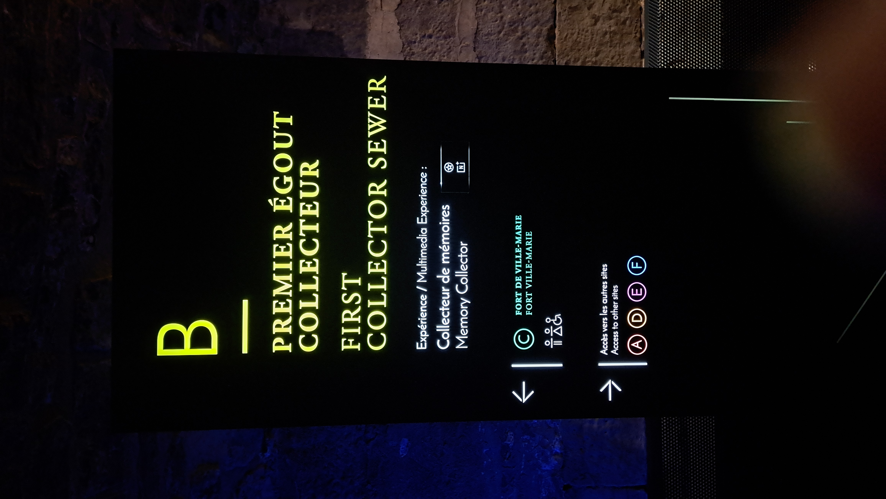
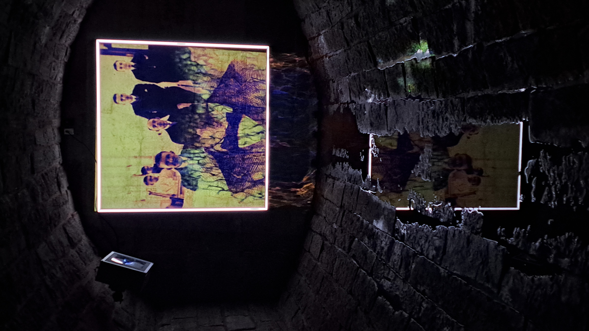
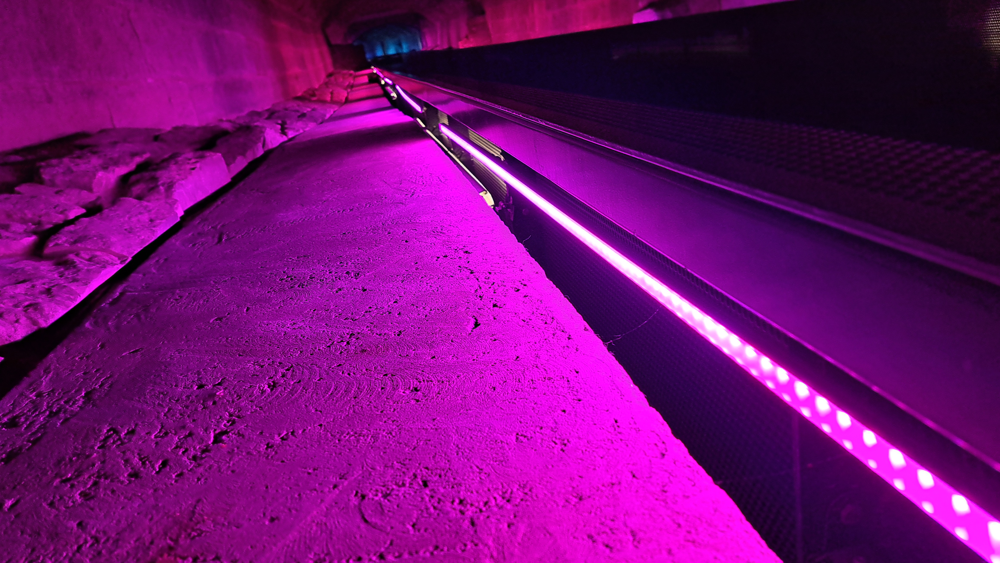
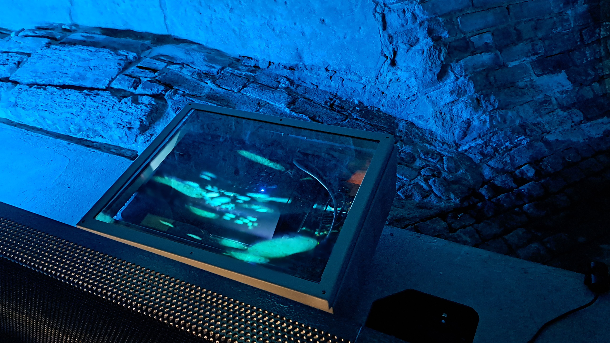
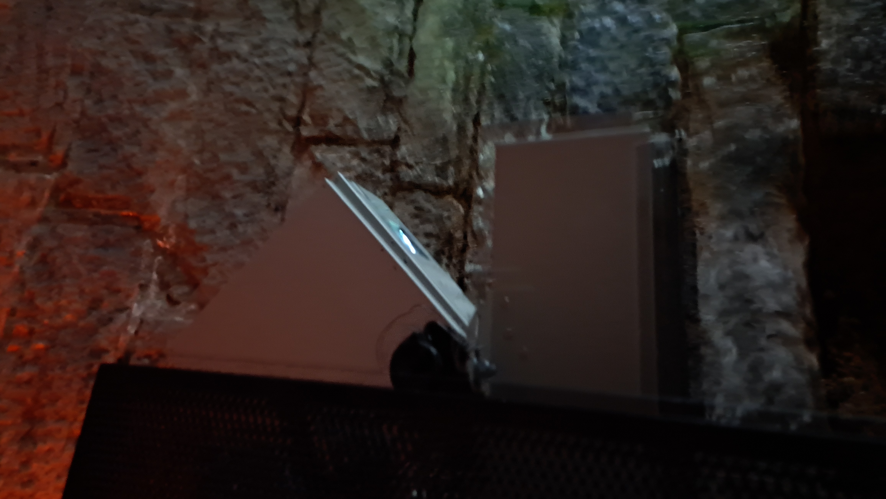
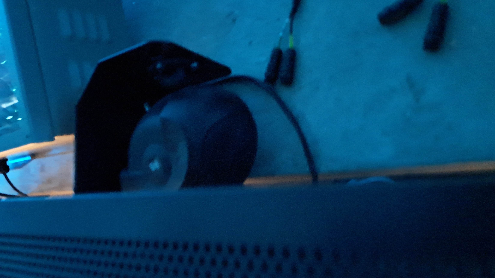
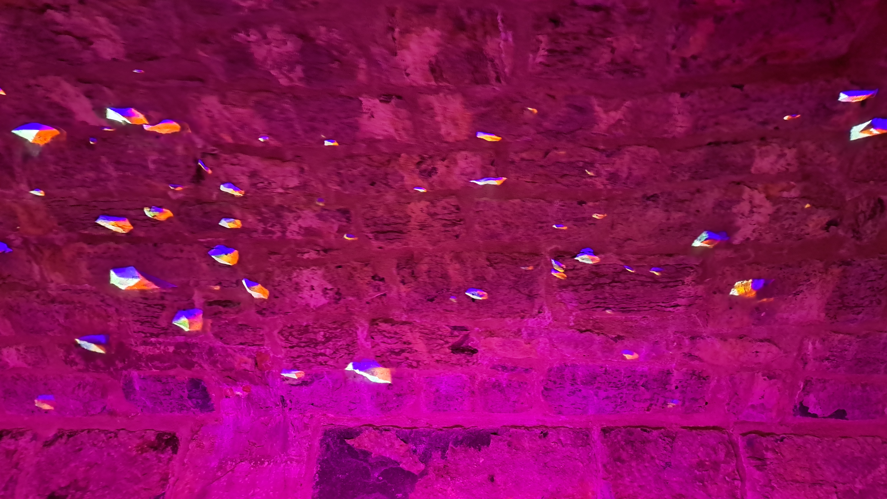

# Collecteur de mémoires #
## Musée pointe-à-caillère ##

Voici la fiche d'inspiration pour l'exposition "Collecteur de mémoires" visité le 1er mars au musée Pointe-à-caillère.

### Description de l'oeuvre ###

"Collecteur de mémoires" est une oeuvre multimédia située dans un ancien égout de la ville de Montréal au musée pointe à caillère. L'exposition consiste d'un long corridor éclairé par des lumières de différentes couleurs. 

 

### Description des dispositifs multimédias ###

### Mon expérience ###

