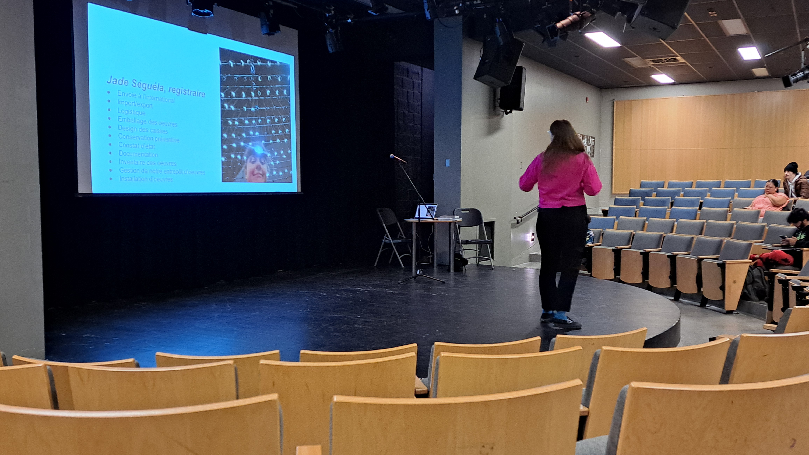
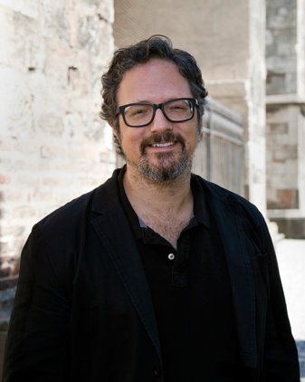
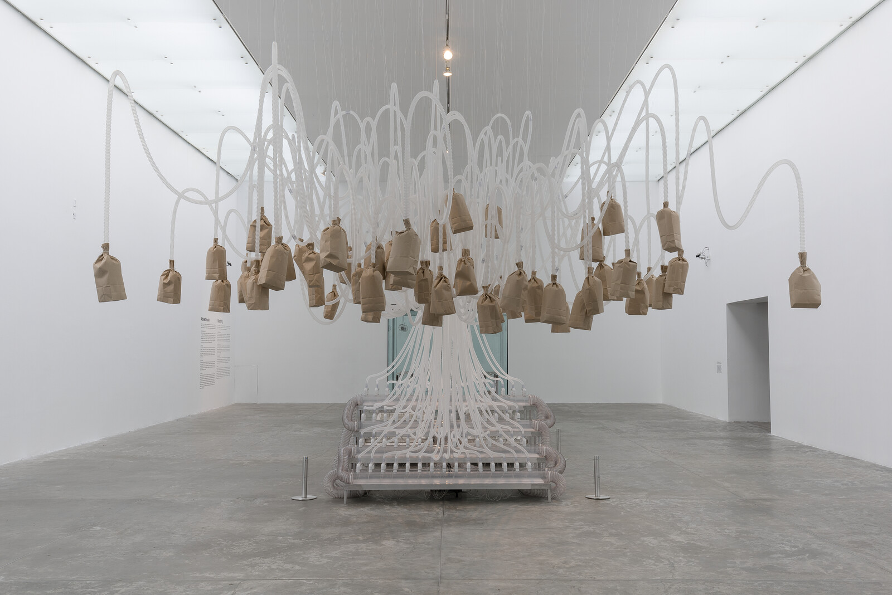
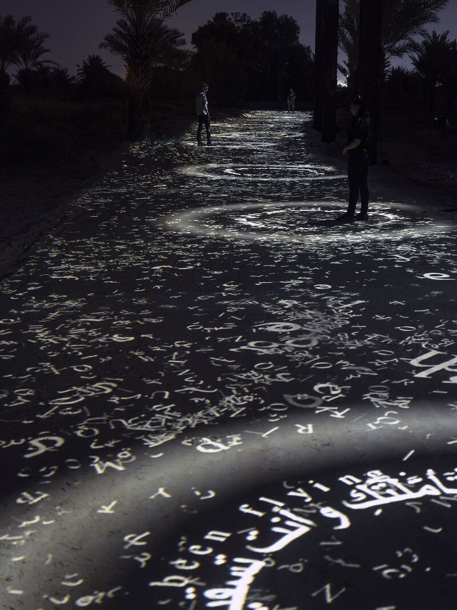
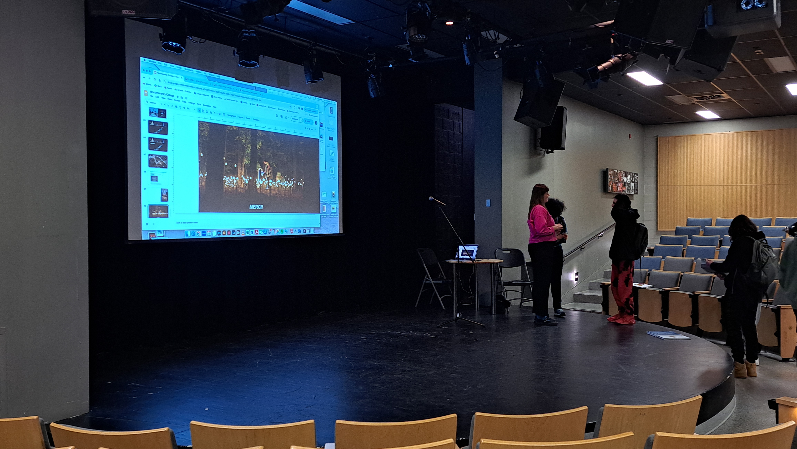

# Conférence sur Rafael Lozano-Hemmer #
## Jade Séguéla ##

### Introduction ###

Le 16 avril 2024, Jade Séguéla, la registraire du studio d'art multimédia de Rafael Lozano-Hemmer, est venue au cégep Montmorency pour donner une conférence sur son travail dans ce studio et les étapes de production de leurs projets. Voici mon compte-rendu de cette conférence.

### Jade Séguéla ###

Jade Séguéla est la registraire du studio, ce qui veut dire qu'elle doit documenter tout les projets de l'équipe pour être capable de les transporter vers les différents musés qui achètent les oeuvres du studio. Avec les listes qu'elle compile, il est possible de savoir toute les composantes d'une oeuvre, dans quels boites elles sont rangées et comment elle doit être réassemblée une fois à destination. Son travail est essenciel à l'équipe puisque le Rafael Lozano-Hemmer produit toutes ses oeuvres dans le studio avant de les démonter pour les transporter aux différents musés et elle est la seule registraire de l'équipe.

Source: Conférence présentée par Jade Séguéla à la salle Claude Legault au cégep Montmorency.

### Rafale Lozano-Hemmer ###

Source: [Pace gallery](https://www.pacegallery.com/artists/rafael-lozano-hemmer/).

Rafael Lozano-Hemmer est un artiste mexicain vivant au Québec. Son premier succès en tant qu'artiste seul fut l'exposition "Surface tension" exposé en 1992. Cette exposition consistait de plusieurs dispositifs multimédias qui réagissaient aux visiteurs en montranr différentes photos d'un oeil qui regardait les passants. En 2003, Rafael fondat son studio d'art multimédia, ce qui le permettait de concevoirs de plus grands projets. Ses expositions étranges comprenant autant des ouvres visuelles que sonores étaient toujours presque entièrement interractives et fuent présentées à travers le monde

Source: [e-flux](https://www.e-flux.com/announcements/197326/rafael-lozano-hemmerunstable-presence/).

### Translation stream ###

Source: [LinkedIn](https://www.linkedin.com/posts/lozanohemmer_delighted-to-announce-that-due-to-public-activity-7149216331958022144-3xRI).

### Conclusion ###

Source: Conférence présentée par Jade Séguéla à la salle Claude Legault au cégep Montmorency.
